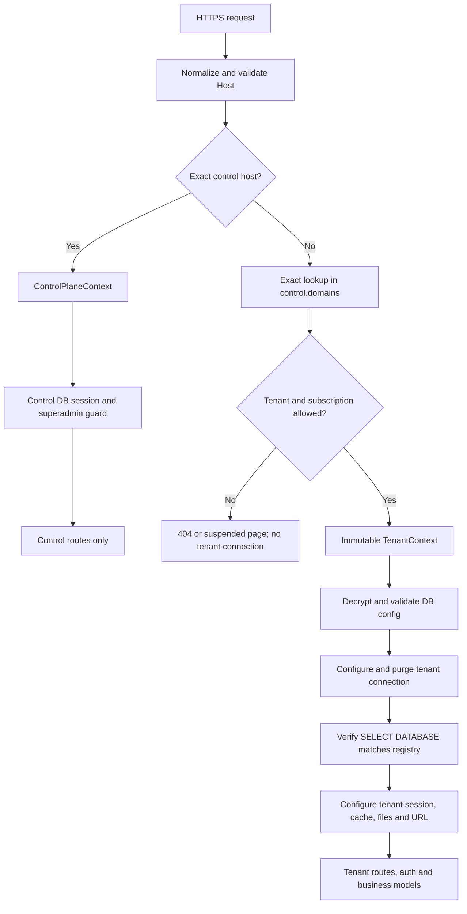

# Shared-Code, Database-per-Domain Architecture Plan

> **Status: implementation plan only.** Do not point customer domains at the shared installation until the safety gates and isolation tests below pass.

## Implementation status (2026-08-03)

The Phase 0/1 safety foundation has started. Tenancy remains **disabled by default** and is not ready for customer traffic.

Implemented:

- Opt-in `config/tenancy.php` and `.env.tenancy.example`.
- Separate static `control` and runtime-configured `tenant` database connections.
- Strict host normalization, exact verified-domain resolver, immutable tenant/control contexts, and fail-closed access decisions.
- Tenant DB driver/host/name allowlists, control-DB rejection, connection purge, and exact `SELECT DATABASE()` verification.
- Earliest global tenancy middleware plus strict tenant/control route-zone middleware.
- Control-plane schema for superadmins, tenants, domains, encrypted credentials, plans, subscriptions, append-only payments, provisioning history, audit history, sessions, cache, and jobs.
- Explicit central Eloquent models; tenant model guard for new tenant-owned models.
- Shared-mode blocks for installer, updater, global config mutation, global cache, payment/SMS/mail configuration, and QuickBooks paths until tenant-scoped replacements exist.
- Permanently disabled legacy `auto:Migrate` command that previously ran `migrate:fresh`.
- Explicit `control:migrate --confirm-control` command.
- Standalone global scheduler commands are disabled when tenancy mode is on until tenant-aware replacements exist.
- Automated foundation tests covering hostile hosts, exact domain resolution, domain verification, subscriptions, control-host reservation, credential policy, central schema, append-only records, and dangerous-operation blocking.

Not yet implemented and therefore blocking `TENANCY_ENABLED=true` in production:

- Authenticated superadmin UI/2FA and tenant management workflows.
- Tenant-aware file migration, database sessions/cache tables, queue middleware, scheduler jobs, backups, signed URLs, OAuth/webhooks, and integrations.
- Safe tenant provision/migrate/backup/restore commands.
- Conversion of all existing business models and raw queries to guarded tenant execution.
- Two-real-MySQL-database isolation suite, canary rollout, and hPanel deployment rehearsal.
- Resolution of the pre-existing `attendance_by_employee` API route, which currently references the absent `App\\Http\\Controllers\\hrm\\EmployeeSessionController` and prevents `artisan route:list` from completing.

The control schema can be prepared only after supplying a dedicated control DB and reviewing its target:

```bash
php artisan control:migrate --confirm-control
```

Do not set `TENANCY_ENABLED=true` on a customer-facing deployment yet.

## 1. Architecture decision

Counter POS will use a **shared-code, multi-database architecture**:

- One deployed Laravel/Vue codebase and one set of compiled assets.
- One central **control-plane database** containing tenants, domains, subscriptions, manual payments, encrypted database connection metadata, provisioning status, superadmins, and audit logs.
- One separate **tenant database per customer**. Existing business tables remain tenant-local and do not need a `tenant_id` column.
- `admin.counterpos.pk` serves the superadmin control plane only.
- Every customer domain/subdomain points to the same `public/` folder. Its exact hostname selects one tenant and one database before any business query runs.
- hPanel database and domain creation remains manual. The application registers and manages them after creation.

This is intentionally not a shared-table SaaS conversion. It saves the inodes consumed by duplicate source/vendor/assets while retaining database-level customer isolation and requiring fewer changes to existing modules.

### First-release non-goals

- No automatic payment gateway or customer self-provisioning.
- No automatic domain/database creation from HTTP requests.
- No cross-tenant business reports or queries.
- No PHP, Laravel, Vue, or dependency-stack upgrade as part of tenancy work.
- No arbitrary SQL, shell, file-manager, or `.env` editor in the dashboard.

## 2. Mandatory security invariants

1. Resolve the exact normalized hostname **before sessions, auth, Passport, cache, route bindings, or models execute**.
2. Unknown, malformed, inactive, duplicate, or unverified hosts fail closed with `404` or a suspension page. Never fall back to the control DB, `.env` tenant DB, or the last-used tenant.
3. Control-plane models always use an explicit `control` connection. Tenant models refuse to query without an immutable `TenantContext`.
4. A request can have exactly one tenant. Application code cannot switch tenant midway through a request.
5. `admin.counterpos.pk` can never resolve to a tenant. Tenant hosts can never access superadmin routes, even by guessing the path.
6. Runtime DB users are scoped to one database and have no `CREATE DATABASE`, `DROP DATABASE`, user-management, or global privileges.
7. No HTTP controller may run migrations, seeders, rollbacks, `migrate:fresh`, `db:wipe`, Passport installation, global maintenance, or update commands.
8. Tenant settings may not edit the shared `.env`, regenerate shared Passport keys, or clear shared/global caches.
9. Sessions, cache, queues, scheduled work, locks, uploads, exports, backups, tokens, webhooks, and logs must carry tenant identity and be isolated.
10. Never run a destructive action for every tenant in a loop. Use one explicit tenant UUID, verify its exact database, obtain a backup, lock it, run the action, and record the result.

## 3. Request lifecycle



`ResolveTenantOrControlPlane` must run before Laravel's `StartSession`, `Authenticate`, `CreateFreshApiToken`, `SetSessionConfig`, and `SubstituteBindings` middleware.

## 4. Host resolution

Use environment-backed configuration through a new `config/tenancy.php`:

```env
TENANCY_ENABLED=true
CONTROL_PLANE_HOST=admin.counterpos.pk
TENANT_DB_ALLOWED_HOSTS=localhost,127.0.0.1,<actual-hpanel-mysql-host>
TENANT_DB_NAME_PREFIX=<hpanel-account>_counter_
SESSION_SECURE_COOKIE=true
```

A code constant may default the control host to `admin.counterpos.pk`, but the environment value must be authoritative for staging/local environments.

Host rules:

- Use Laravel's trusted request host, not an unvalidated `X-Forwarded-Host` value. Trust only actual hPanel/CDN proxies.
- Lowercase, remove one trailing dot, convert IDNs to ASCII/Punycode, and reject ports, paths, wildcards, control characters, IP hosts, and invalid DNS labels.
- Exact-match `domains.normalized_host` with a unique DB index. Never use suffix/substring matching.
- Aliases are separate verified domain rows pointing to the same tenant; one is primary.
- Redirect an alias only after both domains resolve to the same tenant. Do not preserve sensitive query parameters.
- Cache resolution for at most 30-60 seconds and invalidate exact keys immediately on domain/status changes.
- If the control DB or credential decryption fails, return a generic service-unavailable response. Do not reuse an old connection.

## 5. Database and context design

Add named connections:

- `control`: static `CONTROL_DB_*` configuration, never changed at runtime.
- `tenant`: an empty template populated after successful hostname resolution.

Recommended classes:

```text
app/Tenancy/TenantContext.php
app/Tenancy/ControlPlaneContext.php
app/Tenancy/HostNormalizer.php
app/Tenancy/TenantResolver.php
app/Tenancy/TenantDatabaseManager.php
app/Tenancy/TenantFilesystemManager.php
app/Tenancy/TenantExecution.php
app/Http/Middleware/ResolveTenantOrControlPlane.php
app/Http/Middleware/RequireControlPlaneHost.php
app/Http/Middleware/RequireActiveTenant.php
```

`TenantDatabaseManager` must:

1. Accept only an already-resolved `TenantContext`, never a tenant/DB name from request input.
2. Load credentials using the explicit `control` connection.
3. Decrypt the password with Laravel encryption without ever logging/serializing it.
4. Reject DB hosts outside `TENANT_DB_ALLOWED_HOSTS` and names outside the configured prefix/allowlist. This also prevents the connection tester from becoming SSRF.
5. Set only `database.connections.tenant`, call `DB::purge('tenant')`, make it default, and reconnect.
6. Execute `SELECT DATABASE()` and require an exact match with the registered database before business queries.
7. Store only sanitized connection health/errors in control data.

Create `ControlPlaneModel` with `$connection = 'control'`. Create `TenantModel` that throws if no `TenantContext` exists. This protects HTTP, CLI, tests, and workers from accidental default-connection usage.

Persistent queue/test processes require `TenantExecution::run($tenantId, Closure $work)`: initialize in `try`, then purge the connection and clear context in `finally` before processing another tenant.

## 6. Control-plane schema

Put new central migrations under `database/migrations/control/`. Existing business migrations become the tenant migration set under `database/migrations/tenant/`. Production must not rely on an ambiguous plain `artisan migrate`.

### Central tables

- `super_admins`: UUID/public ID, name/email/password, active flag, last login, encrypted TOTP secret, recovery-code hashes. Separate guard/provider from tenant users.
- `tenants`: UUID, name/slug/contact, status (`provisioning`, `active`, `suspended`, `archived`, `failed`), suspension reason/times, schema version, health time, optimistic-lock version.
- `domains`: tenant UUID, original/normalized host, primary/verified flags and times. Unique normalized host. Forbid the control host.
- `tenant_databases`: tenant UUID, driver/host/port/database/username, encrypted runtime password, optional separately encrypted migration credential, SSL settings, credential version, health/result fields. Hide all secrets from serialization.
- `plans`: name, interval, price/currency, active flag, optional feature metadata.
- `subscriptions`: tenant/plan, start/end/grace dates, status, agreed price/currency, notes and actor. Historical amounts do not change with plan price.
- `manual_payments`: UUID, tenant/subscription, reference, amount/currency/date/method/notes/actor. Append-only; corrections are reversal rows, never edits/deletes.
- `provisioning_runs`: tenant/action/schema target/status/times/actor/sanitized results. No credentials, dumps, or secret-bearing traces.
- `control_audit_logs`: append-only actor/action/target/request ID/redacted before-after/IP/user agent/time. Required for domains, credentials, subscription/payment, status, backup, restore, provisioning, and migration.

Effective access rules:

- Manual suspension/archive always denies.
- Provisioning/failed denies.
- Active tenant + active subscription permits.
- Grace permits until its deadline with a notice.
- Expired/cancelled denies.
- Renewal and manual suspension are separate actions; activation must not silently bypass expiry.
- Middleware computes from dates even if cron missed a run.

## 7. Superadmin dashboard

Use separate code and routing:

```text
routes/control.php
app/Http/Controllers/ControlPlane/
app/Models/ControlPlane/
resources/src/control-plane/  (or Blade for a faster initial version)
```

Load control routes only for the exact configured host. Apply a dedicated control guard/session, CSRF, strict rate limits, secure HTTP-only SameSite cookies, mandatory 2FA, and recent-password/2FA confirmation before sensitive actions. An IP/Cloudflare allowlist can be defense in depth.

Tenant hosts return `404` for control paths. The control host returns `404` for tenant login, POS, store, portal, setup, update, customer display, and tenant APIs. Do not redirect between security zones.

Initial features:

1. Tenant list with status, primary domain, expiry, schema version, and health.
2. Register tenant and manually-created DB credentials.
3. Domain/alias management and verification state.
4. Allowlisted, read-only DB connection test.
5. Provision empty DB or register/migrate an existing customer DB via safe job/CLI workflow.
6. Activate/suspend/archive with reason and audit log.
7. Plans, subscriptions, grace and renewal.
8. Manual payments and append-only reversals.
9. Credential replacement/rotation (show a mask, not recoverable plaintext).
10. Per-tenant backup, migration, schema and health history.

Never add arbitrary SQL, database deletion, mass migration, raw shell/log download, global file management, or `.env` editing.

## 8. Isolation beyond the database

### Sessions and cookies

- Resolve tenant before `StartSession`.
- Use database sessions in the selected tenant DB to save inodes; control sessions use the control DB.
- Control and tenant cookies have distinct names and remain host-only. Never set `.counterpos.pk` as cookie domain.
- Regenerate IDs on login and privilege change.

### Cache and locks

- Prefer tenant-local database cache, or Redis later with immutable `tenant:{uuid}:` prefixes.
- Use a separate control store/prefix.
- Replace global `Cache::flush()`/`cache:clear` in tenant code with scoped invalidation.
- Include tenant UUID in locks, throttles, reports, customer-display tokens, sync state, and temporary exports.

### Passport/authentication

- One shared Passport signing-key pair may serve the installation, but no tenant HTTP route may regenerate it.
- Passport token tables remain per tenant. Resolve tenant before token auth.
- Control auth never uses the tenant Passport guard.
- Test that a Tenant A token is rejected on Tenant B even when user IDs match.

### Queues and scheduler

- Use one control queue table if Redis is unavailable.
- Every tenant job gets a trusted internal tenant UUID, never host/DB input from the user.
- Job middleware resolves, initializes, and always clears context in `finally`.
- Redact tenant content/credentials in failed jobs.
- On hPanel use short `queue:work --stop-when-empty` cron runs if long workers cannot be supervised.
- Run one scheduler cron, not one per customer. Tenant tasks dispatch one isolated job per eligible UUID.

### URLs and integrations

`APP_URL` is not a customer URL. Generate links from the verified tenant primary domain. Bind signed invoices, password links, OAuth state, callbacks, and webhook secrets to tenant/domain so they cannot replay across hosts.

### Files and backups

Audit all `public_path`, `storage_path`, `move`, and `Storage::disk('public')` calls. Use:

```text
storage/app/tenants/{uuid}/public/
storage/app/tenants/{uuid}/private/
storage/app/tenants/{uuid}/tmp/
```

- Generate paths through `TenantFilesystemManager`; never trust a UUID/path from the URL.
- Serve private documents through authorized controllers.
- Reject traversal, absolute paths, wrappers, executables, double extensions, excessive size, and invalid MIME.
- Disable script execution in uploads and use random filenames.
- Back up one tenant DB plus its file root. Restore metadata records exact tenant/database.
- Logs carry tenant UUID + request ID and redact secrets. Prefer one structured log if per-tenant files recreate inode pressure.
- Compiled assets, vendor, translations, and static icons stay shared/read-only.

## 9. Current standalone hazards to remove

The audit found behavior that must not enter shared production:

- `SetupController` and `app/Console/Commands/Migrate.php` call `migrate:fresh`.
- Setup is controlled by one global `storage/app/public/installed` marker.
- Update/auto-update controllers run migrations, rollback, global maintenance, seeders, and cache clears from HTTP.
- SMS, payment, QuickBooks, and settings controllers edit/rebuild global configuration/`.env`.
- Files, sessions, cache, customer-display tokens, backups, and some scheduled work are global.

Required fixes:

1. When tenancy is enabled, permanently return `404` for `/setup` and `/update` on every host.
2. Replace the installed marker with central tenant provisioning state.
3. Remove/rename the destructive migrate command and block it in production.
4. Remove all HTTP-triggered migration/rollback/seed/Passport/down/up/global-cache Artisan calls.
5. Replace auto-update with a reviewed deploy: backups, control migration, one canary tenant, then explicit one-tenant rollout.
6. Put tenant integration settings/secrets in its DB with encrypted casts; never mutate shared `.env`.
7. Add a boot/test assertion that tenancy production refuses to start if setup/update or destructive routes/commands remain.

## 10. Destructive-operation design

Allow only explicit commands:

```text
php artisan control:migrate --confirm-control
php artisan tenant:provision --tenant=<uuid>
php artisan tenant:migrate --tenant=<uuid> --target=<version>
php artisan tenant:seed-reference --tenant=<uuid>
php artisan tenant:backup --tenant=<uuid>
php artisan tenant:restore --tenant=<uuid> --backup=<verified-id>
php artisan tenant:health --tenant=<uuid>
```

Do not add a production `migrate-tenants`, `fresh`, `wipe`, or `reset`. Commands accept only tenant UUIDs and load DB metadata from control; they never accept DB names, hosts, users, or SQL arguments.

Before schema/restore work:

1. Acquire per-tenant lock.
2. Resolve trusted tenant metadata.
3. Connect and compare `SELECT DATABASE()` exactly.
4. Prove it is not control/another tenant and satisfies DB-name policy.
5. Create and verify a restorable per-tenant backup.
6. Record pending audit/provisioning entry.
7. Enable tenant-specific maintenance (never global `artisan down`).
8. Run forward migration in isolated context.
9. Run integrity/health checks and clear only tenant cache.
10. Record schema/result and release lock/maintenance in `finally`.

Restore/destructive work requires a second confirmation value bound to tenant UUID + exact database + backup ID, preferably a second superadmin approval. Database deletion remains a manual hPanel action after archive/retention checks; the dashboard never deletes databases.

Preferred DB privilege split:

- Runtime user: `SELECT`, `INSERT`, `UPDATE`, `DELETE` only on one tenant DB.
- Migration user: schema privileges only on the same DB, used only by CLI/provisioning.
- Control user: control DB only.

If hPanel cannot split runtime/migration users, still use a unique one-database user per tenant. Never use one normal runtime MySQL account with access to every customer DB.

## 11. Data-integrity rules

- Transactions wrap multi-table tenant writes and subscription/payment state changes.
- Preserve/add foreign keys, unique constraints, decimal precision, and required columns.
- Manual payments are append-only; reversal references the original.
- Use idempotency keys for provisioning, payment submission, renewal, backup, migration, and restore.
- Store timestamps in UTC and use tenant timezone only for display/business-day logic.
- Archive tenant/domain first; never cascade-delete credentials, ledger, or audit history from normal UI.
- A domain cannot directly change tenants. Use an audited transfer workflow and invalidate both host caches.
- Sensitive superadmin writes use optimistic-lock versions to prevent stale-tab overwrites.

## 12. Implementation phases

### Phase 0 - Safety freeze

1. Back up code, DB, `.env`, Passport keys, and files.
2. Add tenancy/control-host configuration defaulted off.
3. Inventory every raw DB/PDO use, `.env` write, Artisan call, cache flush, file path, job, scheduler, OAuth/webhook, import/export, and backup.
4. Disable installer/update/destructive behavior under tenancy mode.
5. Add tests proving those routes are absent.
6. Confirm standalone smoke tests still pass.

### Phase 1 - Control foundation

1. Add control connection/migrations and explicit central models.
2. Add normalizer/resolver, immutable contexts, earliest middleware.
3. Add encrypted credentials with host/name policies.
4. Add safe connection/health CLI and audit/request IDs.

### Phase 2 - Tenant runtime

1. Add guarded connection manager and `TenantModel`.
2. Resolve before sessions/Passport.
3. Scope sessions, cache, locks, throttles, tokens and temp data.
4. Add tenant file roots and migrate path usages.
5. Make queues/scheduler context-safe.
6. Bind signed URLs/OAuth/webhooks to tenant.
7. Replace `.env` tenant settings with encrypted DB settings.

### Phase 3 - Superadmin

1. Add separate guard/session/login/2FA/host routes.
2. Tenant/domain/credential UI with secret masking and audit.
3. Plans/subscriptions/grace/manual payment/reversal.
4. Activation/suspension and suspension page.
5. Safe one-tenant provisioning/backup/migration/health jobs.

### Phase 4 - Test and migration tooling

1. Split control/tenant migration paths without changing existing tenant migration order.
2. Add explicit safe commands; block ambiguous/destructive commands.
3. Create control + two test tenant DBs.
4. Pass all isolation/failure/destructive tests.
5. Rehearse empty provisioning and importing an existing customer backup.

### Phase 5 - Canary rollout

1. Deploy into a new shared location; every domain document root points only to `current/public`.
2. Prefer prebuilt assets and omit production `node_modules` to save inodes.
3. Configure HTTPS for admin and tenant domains.
4. Run an internal tenant, then one low-risk customer from backups.
5. Observe logs, jobs, connection counts, sessions, backups, and integrations.
6. Add customers gradually; never migrate all customers in the first window.

## 13. hPanel layout and deployment

```text
/home/<account>/apps/counter-pos/current/       shared release
/home/<account>/apps/counter-pos/releases/...  versioned releases
/home/<account>/apps/counter-pos/shared/.env   global/control secrets
/home/<account>/apps/counter-pos/shared/storage/
```

- Point all domains to `.../current/public`, never repository root.
- Deny web access to `.env`, `.git`, vendor, storage, backups, logs, and sensitive maps.
- Use a `current` symlink for atomic rollback if hPanel supports it.
- Build off-server/once per release; do not retain `node_modules` in production if unnecessary.
- Share writable storage outside release and link it.
- Run one scheduler cron.
- Enforce HTTPS, then HSTS only after every domain has valid TLS.
- Production requires `APP_DEBUG=false` and redacted error pages.

## 14. Required tests

### Host/control isolation

- Active exact host resolves correctly; unknown/malformed/spoofed/trailing-dot/control cases fail closed.
- Duplicate normalized domain is impossible.
- Control routes are `404` on tenant hosts and tenant routes `404` on control host.

### Database isolation

- Tenants A/B can both have `users.id=1`, yet requests read/write only their DB.
- Transactions, validation, Passport, password reset, reports/import/export remain isolated.
- Registry/`SELECT DATABASE()` mismatch aborts before business SQL.
- Bad credentials/control outage/inactive tenant never falls back.
- Same worker processes A then B without context leakage.

### Other isolation

- Sessions/remember cookies, cache, locks, throttles, display tokens, files, logs, backups, and signed URLs do not cross tenants.
- A file, OAuth callback, webhook, invoice signature, or Passport token from A is rejected on B.

### Billing/control security

- Suspension overrides dates; expiry/grace is deterministic.
- Payment double-submit is idempotent; reversal preserves original.
- Disabled superadmin/user cannot authenticate.
- 2FA, recent-auth and rate limits protect sensitive actions.
- Credentials never appear in HTML/JSON/logs/audits/errors.

### Destructive safety

- Setup/update/destructive web routes are absent.
- Production refuses fresh/wipe/ambiguous commands or missing tenant UUID.
- Migration refuses control/another DB, wrong prefix, missing backup, or missing lock.
- Failed migration affects only selected tenant and has backup/audit trail.

## 15. Operational runbooks

### Add customer

1. Create DB and least-privileged user manually in hPanel.
2. Create tenant as `provisioning`; enter/test credentials.
3. Add/verify exact domain but keep inactive.
4. Provision empty schema or register/migrate backed-up existing DB.
5. Verify schema, reference data, file root, tenant admin, auth and health.
6. Add subscription/manual payment.
7. Point DNS/document root, enable TLS, smoke test, then activate.

### Suspend/renew

- Suspension records reason and invalidates access cache; it deletes nothing.
- Renewal appends subscription/payment history rather than editing old rows.
- Reactivation requires both tenant and subscription checks.

### Deploy update

1. Back up code/control DB and review tenant migrations.
2. Deploy shared code; never migrate via HTTP.
3. Migrate control explicitly.
4. Back up/migrate/verify one canary tenant.
5. Roll forward one tenant at a time in bounded batches.
6. Stop on first unexpected failure; do not roll back every tenant automatically.

### Offboard

1. Suspend, export and back up.
2. Archive tenant/domains and retain audit/payment history.
3. Remove DNS only after handoff/retention requirements.
4. Delete DB/files manually in hPanel only after retention + verified backup. No dashboard delete button.

## 16. Definition of done

Customer rollout starts only when:

- Admin and tenant hosts are strongly separated.
- Two-tenant tests pass for HTTP, CLI, workers, scheduler, Passport, cache, sessions, files, URLs, integrations, and failure modes.
- Installer/update/`.env` mutation/global cache/global maintenance hazards are removed.
- Superadmin has separate guard, 2FA, audit, secret masking, and recent-auth.
- Activation, suspension, subscription, payment and reversal work without deletion.
- Per-tenant backup/restore is rehearsed.
- A canary tenant succeeds on hPanel before wider rollout.

Shared code solves the inode problem. The implementation must still isolate every database, credential, session, cache entry, file, token, job, integration, backup, and administrative action.
